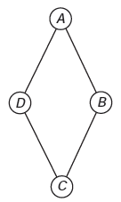
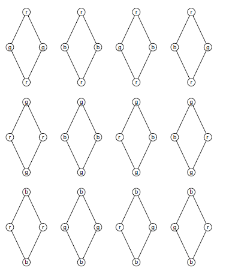
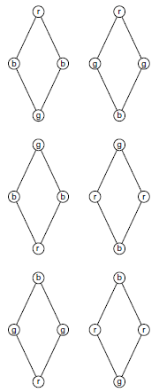
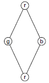
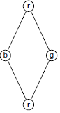

     Um artesão de joias tem à sua disposição pedras brasileiras de três cores: vermelhas, azuis e verdes.

     Ele pretende produzir joias constituídas por uma liga metálica, a partir de um molde no formato de um losango não quadrado com pedras nos seus vértices, de modo que dois vértices consecutivos tenham sempre pedras de cores diferentes.

     A figura ilustra uma joia, produzida por esse artesão, cujos vértices A, B, C e D correspondem às posições ocupadas pelas pedras.

Com base nas informações fornecidas, quantas joias diferentes, nesse formato, o artesão poderá obter?

- [ ] 6
- [x] 12
- [ ] 18
- [ ] 24
- [ ] 36

Nas figuras, as letras r, g e b denotam, nessa ordem, as cores vermelha, verde e azul.

• Há 12 casos em que as pedras nos vértices A e C têm a mesma cor:

• Há 6 casos em que as pedras nos vértices A e C não têm a mesma cor:

Observe que os casos  e  representam a mesma joia.

Desse modo, há 6 pares, dos casos acima, que também são iguais entre si. Portanto, podem-se obter 12 joias diferentes.

 
