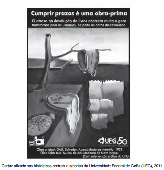

Considerando-se a finalidade comunicativa comum do gênero e o contexto específico do Sistema de Biblioteca da UFG, esse cartaz tem função predominantemente

- [ ] socializadora, contribuindo para a popularização da arte.
- [ ] sedutora, considerando a leitura como uma obra de arte.
- [ ] estética, propiciando uma apreciação despretensiosa da obra.
- [x] educativa, orientando o comportamento de usuários de um serviço.
- [ ] contemplativa, evidenciando a importância de artistas internacionais.

O quadro surrealista A persistência da memória, de Salvador Dalí, reproduz relógios derretidos que podem sugerir a “liquidez” do tempo e a necessidade de ele ser aproveitado adequadamente antes que se esgote. Desse modo, o cartaz do Sistema da Biblioteca da UFG sugere que os prazos estipulados pela mesma devam ser respeitados.

        