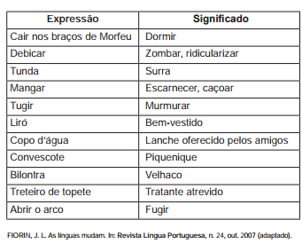

TEXTO I

Antigamente

Antigamente, os pirralhos dobravam a língua diante dos pais e se um se esquecia de arear os dentes antes de cair nos braços de Morfeu, era capaz de entrar no couro. Não devia também se esquecer de lavar os pés, sem tugir nem mugir. Nada de bater na cacunda do padrinho, nem de debicar os mais velhos, pois levava tunda. Ainda cedinho, aguava as plantas, ia ao corte e logo voltava aos penates. Não ficava mangando na rua, nem escapulia do mestre, mesmo que não entendesse patavina da instrução moral e cívica. O verdadeiro smart calçava botina de botões para comparecer todo liró ao copo d’água, se bem que no convescote apenas lambiscasse, para evitar flatos. Os bilontras é que eram um precipício, jogando com pau de dois bicos, pelo que carecia muita cautela e caldo de galinha. O melhor era pôr as barbas de molho diante de um treteiro de topete, depois de fintar e engambelar os coiós, e antes que se pusesse tudo em pratos limpos, ele abria o arco.

ANDRADE, C. D. Poesia e prosa. Rio de Janeiro: Nova Aguilar, 1983 (fragmento).

TEXTO II

Palavras do arco da velha

Na leitura do fragmento do texto Antigamente constata-se, pelo emprego de palavras obsoletas, que itens lexicais outrora produtivos não mais o são no português brasileiro atual. Esse fenômeno revela que

- [ ] a língua portuguesa de antigamente carecia de termos para se referir a fatos e coisas do cotidiano.
- [ ] o português brasileiro se constitui evitando a ampliação do léxico proveniente do português europeu.
- [ ] a heterogeneidade do português leva a uma estabilidade do seu léxico no eixo temporal.
- [ ] o português brasileiro apoia-se no léxico inglês para ser reconhecido como língua independente.
- [x] o léxico do português representa uma realidade linguística variável e diversificada.

O fato de o léxico do português ter-se alterado ao longo do tempo comprova uma “realidade linguística variável e diversificada”.
