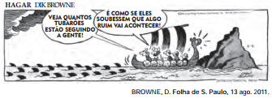

As palavras e as expressões são mediadoras dos sentidos produzidos nos textos. Na fala de Hagar, a expressão “é como se” ajuda a conduzir o conteúdo enunciado para o campo da

- [ ] conformidade, pois as condições meteorológicas evidenciam um acontecimento ruim.
- [ ] reflexibilidade, pois o personagem se refere aos tubarões usando um pronome reflexivo.
- [ ] condicionalidade, pois a atenção dos personagens é a condição necessária para a sua sobrevivência.
- [x] possibilidade, pois a proximidade dos tubarões leva à suposição do perigo iminente para os homens.
- [ ] impessoalidade, pois o personagem usa a terceira pessoa para expressar o distanciamento dos fatos.

A expressão “é como se” estabelece uma analogia do qual se infere a possibilidade do perigo iminente.
