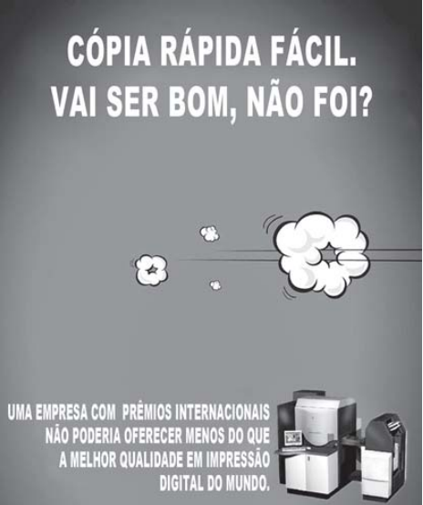

 

Disponível em: www.behance.net. Acesso em: 21 fev. 2013 (adaptado).

 

A rapidez é destacada como uma das qualidades do serviço anunciado, funcionando como estratégia de persuasão em relação ao consumidor do mercado gráfico. O recurso da linguagem verbal que contribui para esse destaque é o emprego

- [ ] do termo “fácil” no início do anúncio, com foco no processo.
- [ ] de adjetivos que valorizam a nitidez da impressão.
- [x] das formas verbais no futuro e no pretérito, em sequência.
- [ ] da expressão intensificadora “menos do que” associada à qualidade.
- [ ] da locução “do mundo” associada a “melhor”, que quantifica a ação.

Na frase do texto publicitário “vai ser bom, não foi”, o verbo no presente do indicativo “vai” tem valor de futuro que, associado ao pretérito perfeito “foi”, revela que a ação de copiar, anunciada pela empresa, é rápida e eficiente.
