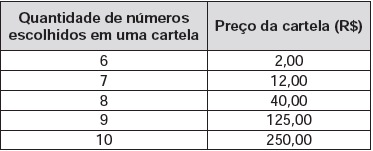

     Considere o seguinte jogo de apostas:

     Numa cartela com 60 números disponíveis, um apostador escolhe de 6 a 10 números. Dentre os números disponíveis, serão sorteados apenas 6. O apostador será premiado caso os 6 números sorteados estejam entre os números escolhidos por ele numa mesma cartela.

     O quadro apresenta o preço de cada cartela, de acordo com a quantidade de números escolhidos.

     Cinco apostadores, cada um com R$ 500,00 para apostar, fizeram as seguintes opções:

     Arthur: 250 cartelas com 6 números escolhidos;

     Bruno: 41 cartelas com 7 números escolhidos e 4 cartelas com 6 números escolhidos;

     Caio: 12 cartelas com 8 números escolhidos e 10 cartelas com 6 números escolhidos;

     Douglas: 4 cartelas com 9 números escolhidos;

     Eduardo: 2 cartelas com 10 números escolhidos.

Os dois apostadores com maiores probabilidades de serem premiados são

- [x] Caio e Eduardo.
- [ ] Arthur e Eduardo.
- [ ] Bruno e Caio.
- [ ] Arthur e Bruno.
- [ ] Douglas e Eduardo.

O número de elementos do espaço amostral, $C\_{60,6}$ é o mesmo para todos os apostadores.

Os números de elementos dos eventos são:

• Arthur: 250 apostas

• Bruno: 41 x $C\_{7,6}$ + 4 = 41 x 7 + 4 = 291 apostas.

• Caio: 12 x $C\_{8,6}$ + 10 = $12 \cdot \cfrac{8!}{6! \cdot 2!} + 10$ = 346 apostas.

• Douglas: 4 x $C\_{9,6}$ = $4 \cdot \cfrac{9!}{6! \cdot 3!}$ = 336 apostas.

• Eduardo: 2 x $C\_{10,6}$ = $2 \cdot \cfrac{10!}{6! \cdot 4!}$ = 420 apostas.

Os dois apostadores com maiores probabilidades são os que estão correndo com maiores números de apostas, isto é, Caio e Eduardo.
