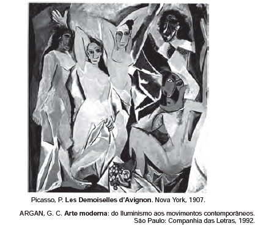

O quadro Les Demoiselles d’Avignon (1907), de Pablo Picasso, representa o rompimento com a estética clássica e a revolução da arte no início do século XX. Essa nova tendência se caracteriza pela

- [x] pintura de modelos em planos irregulares.
- [ ] mulher como temática central da obra.
- [ ] cena representada por vários modelos.
- [ ] oposição entre tons claros e escuros.
- [ ] nudez explorada como objeto de arte.

O quadro “Les Demoiselles d’Avignon” rompe com a perspectiva em pintura, armando a representação em planos irregulares, resultantes da multiplicação de pontos de vista. As formas ganham novos arranjos com alterações das relações espaciais.
