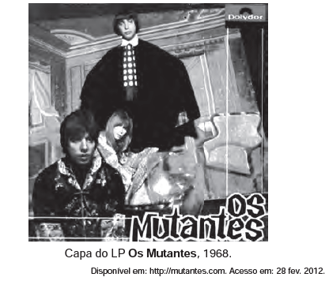

A capa do LP Os Mutantes, de 1968, ilustra o movimento da contracultura. O desafio à tradição nessa criação musical é caracterizado por

- [ ] letras e melodias com características amargas e depressivas.
- [ ] arranjos baseados em ritmos e melodias nordestinos.
- [x] sonoridades experimentais e confluência de elementos populares e eruditos.
- [ ] temas que refletem situações domésticas ligadas à tradição popular.
- [ ] ritmos contidos e reservados em oposição aos modelos estrangeiros.

A simples reprodução da capa do LP em questão não é suficiente para que se chegue à resposta deste teste. Para isto, necessita-se de conhecimento do conteúdo do disco — algo que não se pode exigir dos estudantes, a menos que tal exigência fosse previamente explicitada.
