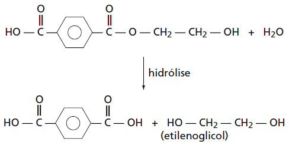

     O uso de embalagens plásticas descartáveis vem crescendo em todo o mundo, juntamente com o problema ambiental gerado por seu descarte inapropriado. O politereftalato de etileno (PET), cuja estrutura é mostrada, tem sido muito utilizado na indústria de refrigerantes e pode ser reciclado e reutilizado. Uma das opções possíveis envolve a produção de matérias-primas, como o etilenoglicol (1,2-etanodiol), a partir de objetos compostos de PET pós-consumo.

Com base nas informações do texto, uma alternativa para a obtenção de etilenoglicol a partir do PET é a

- [ ] solubilização dos objetos.
- [ ] combustão dos objetos.
- [ ] trituração dos objetos.
- [x] hidrólise dos objetos.
- [ ] fusão dos objetos.

A solubilização, a trituração e a fusão de objetos de PET não irão alterar a composição do polímero, pois correspondem apenas a transformações físicas.

A combustão completa do polímero provoca sua degradação total, transformando-o em $\ce{CO2}$ e $\ce{H2O}$.

Assim, a única possibilidade de obtenção do etilenoglicol é a hidrólise.

Geralmente, a hidrólise de um éster forma um ácido carboxílico e um álcool:

