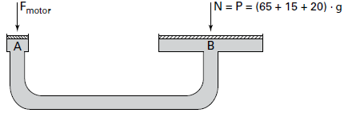

Para oferecer acessibilidade aos portadores de dificuldades de locomoção, é utilizado, em ônibus e automóveis, o elevador hidráulico. Nesse dispositivo é usada uma bomba elétrica, para forçar um fluido a passar de uma tubulação estreita para outra mais larga, e dessa forma acionar um pistão que movimenta a plataforma. Considere um elevador hidráulico cuja área da cabeça do pistão seja cinco vezes maior do que a área da tubulação que sai da bomba. Desprezando o atrito e considerando uma aceleração gravitacional de $10\\,m/s^2$, deseja-se elevar uma pessoa de 65 kg em uma cadeira de rodas de 15 kg sobre a plataforma de 20 kg.

Qual deve ser a força exercida pelo motor da bomba sobre o fluido, para que o cadeirante seja elevado com velocidade constante?

- [ ] 20 N
- [ ] 100 N
- [x] 200 N
- [ ] 1 000 N
- [ ] 5 000 N

A figura a seguir representa de maneira esquemática o sistema hidráulico descrito no enunciado admitindo que não há desnível entre as extremidades.

Como o fluido está em equilíbrio:\
      \
**    $p\_{A}$**             =           **$p\_{B}$\
$p\_{atm} + \cfrac{F\_{mortor}}{S} = p\_{atm} + \cfrac{p}{5S}$**

$F\_{motor} = \cfrac{Mg}{5} = \cfrac{100\cdot 10}{5}$

$F\_{motor} = 200N$
