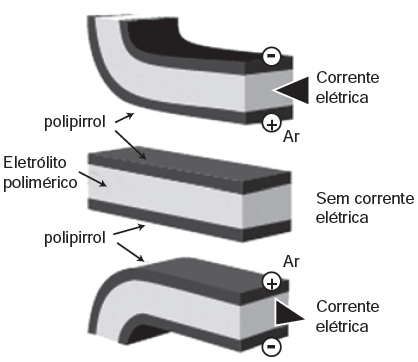

Músculos artificiais são dispositivos feitos com plásticos inteligentes que respondem a uma corrente elétrica com um movimento mecânico. A oxidação e redução de um polímero condutor criam cargas positivas e/ou negativas no material, que são compensadas com a inserção ou expulsão de cátions ou ânions. Por exemplo, na figura os filmes escuros são de polipirrol e o filme branco é de um eletrólito polimérico contendo um sal inorgânico. Quando o polipirrol sofre oxidação, há a inserção de ânions para compensar a carga positiva no polímero e o filme se expande. Na outra face do dispositivo o filme de polipirrol sofre redução, expulsando ânions, e o filme se contrai. Pela montagem, em sanduíche, o sistema todo se movimenta de forma harmônica, conforme mostrado na figura.

DE PAOLI, M. A. **Cadernos Temáticos de Química Nova na Escola**, São Paulo, maio 2001 (adaptado).

A camada central de eletrólito polimérico é importante porque

- [ ] absorve a irradiação de partículas carregadas, emitidas pelo aquecimento elétrico dos filmes de polipirrol.
- [x] permite a difusão dos íons promovida pela aplicação de diferença de potencial, fechando o circuito elétrico.
- [ ] mantém um gradiente térmico no material para promover a dilatação/contração térmica de cada filme de polipirrol.
- [ ] permite a condução de elétrons livres, promovida pela aplicação de diferença de potencial, gerando corrente elétrica.
- [ ] promove a polarização das moléculas poliméricas, o que resulta no movimento gerado pela aplicação de diferença de potencial.

A partir do texto apresentado, tem-se que a oxidação e a redução de um polímero condutor criam cargas positivas e/ou negativas no material. Elas são compensadas com a inserção ou expulsão de cátions ou ânions. Logo, pode-se inferir que esse processo é possibilitado pela presença da camada central do eletrólito polimérico que permite a difusão (transporte) dos íons, fechando o circuito elétrico com a aplicação da diferença de potencial.
