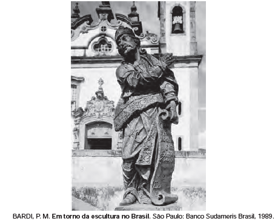

Com contornos assimétricos, riqueza de detalhes nas vestes e nas feições, a escultura barroca no Brasil tem forte influência do rococó europeu e está representada aqui por um dos profetas do pátio do Santuário do Bom Jesus de Matosinho, em Congonhas (MG), esculpido em pedra-sabão por Aleijadinho. Profundamente religiosa, sua obra revela

 

- [ ] liberdade, representando a vida de mineiros à procura da salvação.
- [ ] credibilidade, atendendo a encomendas dos nobres de Minas Gerais.
- [ ] simplicidade, demonstrando compromisso com a contemplação do divino.
- [x] personalidade, modelando uma imagem sacra com feições populares.
- [ ] singularidade, esculpindo personalidades do reinado nas obras divinas.

As esculturas de Aleijadinho são caracterizadas pelo contraste e apelo dramático típicos do Barroco, movido pela inspiração religiosa, mas pactuando com o popular pelas feições humanas comuns atribuídas às suas obras.
