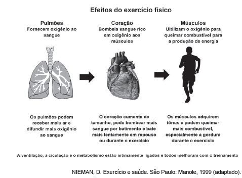

A partir dos efeitos fisiológicos do exercício físico no organismo, apresentados na figura, são adaptações benéficas à saúde de um indivíduo:

- [x] Diminuição da frequência cardíaca em repouso e aumento da oxigenação do sangue.
- [ ] Diminuição da oxigenação do sangue e aumento da frequência cardíaca em repouso.
- [ ] Diminuição da frequência cardíaca em repouso e aumento da gordura corporal.
- [ ] Diminuição do tônus muscular e aumento do percentual de gordura corporal.
- [ ] Diminuição da gordura corporal e aumento da frequência cardíaca em repouso.

As informações sobre os efeitos do exercício físico mostram a diminuição da frequência cardíaca em repouso e a difusão de mais oxigênio no sangue.

        