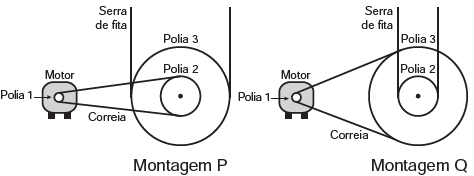

     Para serrar ossos e carnes congeladas, um açougueiro utiliza uma serra de fita que possui três polias e um motor. O equipamento pode ser montado de duas formas diferentes, P e Q. Por questão de segurança, é necessário que a serra possua menor velocidade linear.

Por qual montagem o açougueiro deve optar e qual a justificativa desta opção?

- [x] Q, pois as polias 1 e 3 giram com velocidades lineares iguais em pontos periféricos e a que tiver maior raio terá menor frequência.
- [ ] Q, pois as polias 1 e 3 giram com frequências iguais e a que tiver maior raio terá menor velocidade linear em um ponto periférico.
- [ ] P, pois as polias 2 e 3 giram com frequências diferentes e a que tiver maior raio terá menor velocidade linear em um ponto periférico.
- [ ] P, pois as polias 1 e 2 giram com diferentes velocidades lineares em pontos periféricos e a que tiver menor raio terá maior frequência.
- [ ] Q, pois as polias 2 e 3 giram com diferentes velocidades lineares em pontos periféricos e a que tiver maior raio terá menor frequência.

Pontos nas periferias de polias ligadas por correia apresentam a mesma velocidade escalar (linear).

**• Montagem P            • Montagem Q\
$V\_{1} = V\_{2}$**                       **$V\_{1} = V\_{3}$**\
**$V\_{1} = \omega\_{2} \cdot R\_{2}$    (1)         **$V\_{1} = \omega\_{3} \cdot R\_{3}$   (2)****

Polias que estão fixas ao mesmo eixo de rotação apresentam mesma velocidade angular.

**• Montagem P             • Montagem Q\
$\omega\_{2} = \omega\_{3}$**                       **$\omega\_{3} = \omega\_{2}$**\
**$\omega\_{2} = \cfrac{V\_{3}}{R\_{3}}$         (3)        **$\omega\_{3} = \cfrac{V\_{2}}{R\_{2}}$        (4)****

Substituindo (3) em (1) e (4) em (2):

$V\_{1} = \cfrac{V\_3}{R\_3} \cdot R\_{2}$ => $V\_{3} = (\cfrac{R\_3}{R\_2}) \cdot V\_{1}$

$V\_{1} = \cfrac{V\_2}{R\_2} \cdot R\_{3}$ => $V\_{2} = (\cfrac{R\_2}{R\_3}) \cdot V\_{1}$

Sendo $(\cfrac{R\_3}{R\_2}) > (\cfrac{R\_2}{R\_3})$, podemos afirmar que $V\_3 > V\_2$.

De acordo com o enunciado, a serra deve apresentar velocidade escalar (linear) menos intensa. Para isso, deve- -se escolher a montagem Q, pois ela apresenta velocidade transmitida $(V\_3)$ menos intensa.

$V\_{1} = \omega\_{3} \cdot R\_{3}$

$​​​​\omega\_{1} \cdot R\_{1} = ​​​​\omega\_{3} \cdot R\_{3}$

$2\pi \cdot f\_1 \cdot r\_1 = 2\pi \cdot f\_3 \cdot r\_3$

$f\_1 \cdot r\_1 = \cdot f\_3 \cdot r\_3$

A partir da expressão acima, a polia que possui maior raio apresenta menor frequência.
