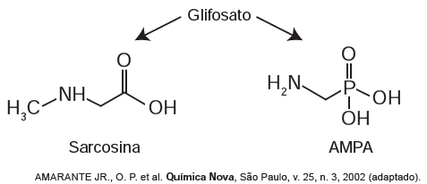
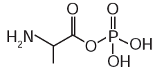
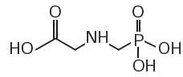
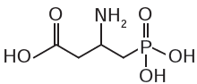
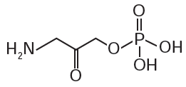
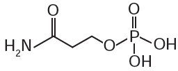
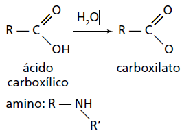
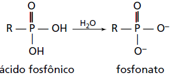

     O glifosato ($\ce{C3H8NO5P}$) é um herbicida pertencente ao grupo químico das glicinas, classificado como não seletivo. Esse composto possui os grupos funcionais carboxilato, amino e fosfonato. A degradação do glifosato no solo é muito rápida e realizada por grande variedade de microrganismos, que usam o produto como fonte de energia e fósforo. Os produtos da degradação são o ácido aminometilfosfônico (AMPA) e o N-metilglicina (sarcosina):

A partir do texto e dos produtos de degradação apresentados, a estrutura química que representa o glifosato é:

- [ ] 
- [x] 
- [ ] 
- [ ] 
- [ ] 

No enunciado, diz-se que na estrutura do glifosato estão presentes os grupos:

\
**e**

\

Apenas as alternativas B e C apresentam estes grupos, porém a molécula da alternativa C possui quatro carbonos, não correspondendo à fórmula molecular apresentada ($\ce{C3H8NO5P}$).

A questão está malformulada, pois leva o candidato a entender que os produtos da degradação do glifosato são obtidos pelo mesmo processo, simultaneamente.
