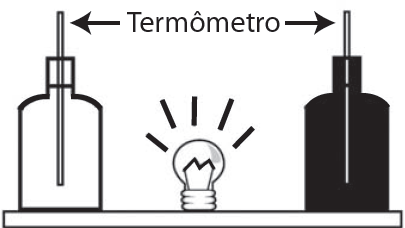

     Em um experimento foram utilizadas duas garrafas PET, uma pintada de branco e a outra de preto, acopladas cada uma a um termômetro. No ponto médio da distância entre as garrafas, foi mantida acesa, durante alguns minutos, uma lâmpada incandescente. Em seguida a lâmpada foi desligada. Durante o experimento, foram monitoradas as temperaturas das garrafas: a) enquanto a lâmpada permaneceu acesa e b) após a lâmpada ser desligada e atingirem equilíbrio térmico com o ambiente.

A taxa de variação da temperatura da garrafa preta, em comparação à da branca, durante todo experimento, foi

- [ ] igual no aquecimento e igual no resfriamento.
- [ ] maior no aquecimento e igual no resfriamento.
- [ ] menor no aquecimento e igual no resfriamento.
- [ ] maior no aquecimento e menor no resfriamento.
- [x] maior no aquecimento e maior no resfriamento.

Comparativamente à garrafa pintada de branco, a pintada de preto absorve uma maior quantidade de energia radiante, convertendo-a em energia térmica, durante o intervalo de tempo considerado. Dessa maneira, a garrafa preta atinge uma maior temperatura em seu aquecimento.

Como, ao desligar a lâmpada, as garrafas retornam à mesma temperatura inicial (temperatura ambiente), a garrafa preta também sofrerá maior variação de temperatura durante seu resfriamento.
