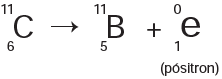

Glicose marcada com nuclídeos de carbono-11 é utilizada na medicina para se obter imagens tridimensionais do cérebro, por meio de tomografia de emissão de pósitrons. A desintegração do carbono-11 gera um pósitron, com tempo de meia-vida de 20,4 min, de acordo com a equação da reação nuclear:

     A partir da injeção de glicose marcada com esse nuclídeo, o tempo de aquisição de uma imagem de tomografia é de cinco meias-vidas.

Considerando que o medicamento contém 1,00 g do carbono-11, a massa, em miligramas, do nuclídeo restante, após a aquisição da imagem, é mais próxima de

- [ ] 0,200.
- [ ] 0,969.
- [ ] 9,80.
- [x] 31,3.
- [ ] 200\.

$t\_{\frac{1}{2}} $ do $\\, ^{11}C = 20,4 \\, min$.

Tempo de aquisição da imagem = 5 meias-vidas

Massa inicial $\\, ^{11}C$ no medicamento = 1,00 g

A partir do decaimento radioativo do $\\, ^{11}C$, tem-se:

1,00 g    $\overset{20,4\\, min}{\rightarrow}$   0,5 g    $\overset{20,4\\, min}{\rightarrow}$   0,25 g   $\overset{20,4\\, min}{\rightarrow}$   0,125 g   $\overset{20,4\\, min}{\rightarrow}$   0,0625 g   $\overset{20,4\\, min}{\rightarrow}$   0,03125 g

Que equivale a 5 meias-vidas.

A massa restante de $\\, ^{11}C$ é de 0,03125 g, ou de 31,25 mg

        