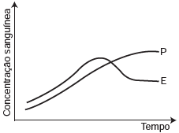
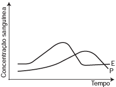
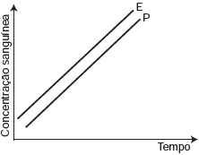
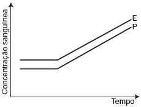

     A pílula anticoncepcional é um dos métodos contraceptivos de maior segurança, sendo constituída basicamente de dois hormônios sintéticos semelhantes aos hormônios produzidos pelo organismo feminino, o estrogênio (E) e a progesterona (P). Em um experimento médico, foi analisado o sangue de uma mulher que ingeriu ininterruptamente um comprimido desse medicamento por dia durante seis meses.

Qual gráfico representa a concentração sanguínea desses hormônios durante o período do experimento?

- [x] 
- [ ] 
- [ ] 
- [ ] 
- [ ] 

Admitindo-se que a dosagem de estrógeno e progesterona seja a mesma em todos os comprimidos, a concentração sanguínea desses hormônios deverá permanecer constante ao longo do tempo considerado.
