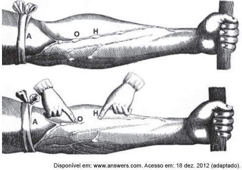

# q
A imagem representa uma ilustração retirada do livro *De Motu Cordis*, de autoria do médico inglês Willian Harvey, que fez importantes contribuições para o entendimento do processo de circulação do sangue no corpo humano. No experimento ilustrado, Harvey, após aplicar um torniquete (A) no braço de um voluntário e esperar alguns vasos incharem, pressionava-os em um ponto (H). Mantendo o ponto pressionado, deslocava o conteúdo de sangue em direção ao cotovelo, percebendo que um trecho do vaso sanguíneo permanecia vazio após esse processo (H-O).

A demonstração de Harvey permite estabelecer a relação entre circulação sanguínea e

# a
pressão arterial.

# b
válvulas venosas.

# c
circulação linfática.

# d
contração cardíaca.

# e
transporte de gases.

# r
b

# s
O deslocamento de sangue e o consequente impedimento de preenchimento daquele trecho venoso demonstrados no experimento são possíveis graças à existência de válvulas no interior das veias.
