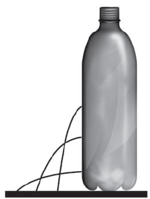

     Para realizar um experimento com uma garrafa PET cheia d´água, perfurou-se a lateral da garrafa em três posições a diferentes alturas. Com a garrafa tampada, a água não vazou por nenhum dos orifícios, e, com a garrafa destampada, observou-se o escoamento da água conforme ilustrado na figura.

Como a pressão atmosférica interfere no escoamento da água, nas situações com a garrafa tampada e destampada, respectivamente?

- [x] Impede a saída de água, por ser maior que a pressão interna; não muda a velocidade de escoamento, que só depende da pressão da coluna de água.
- [ ] Impede a saída de água, por ser maior que a pressão interna; altera a velocidade de escoamento, que é proporcional à pressão atmosférica na altura do furo.
- [ ] Impede a entrada de ar, por ser menor que a pressão interna; altera a velocidade de escoamento, que é proporcional à pressão atmosférica na altura do furo.
- [ ] Impede a saída de água, por ser maior que a pressão interna; regula a velocidade de escoamento, que só depende da pressão atmosférica.
- [ ] Impede a entrada de ar, por ser menor que a pressão interna; não muda a velocidade de escoamento, que só depende da pressão da coluna de água.

Com a garrafa tampada, no instante em que os furos são feitos, a pressão atmosférica é maior que a pressão do líquido na região em contato com o ar, impedindo que a água saia.

Com a garrafa aberta, admitindo que todos os furos sejam pequenos, a velocidade de escoamento vai depender apenas da altura da coluna de líquido.

        