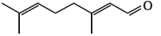
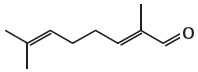
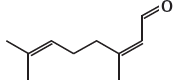
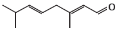
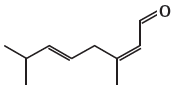
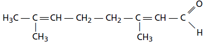
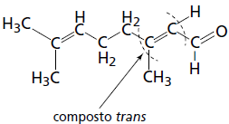

     O citral, substância de odor fortemente cítrico, é obtido a partir de algumas plantas como o capim-limão, cujo óleo essencial possui aproximadamente 80%, em massa, da substância. Uma de suas aplicações é na fabricação de produtos que atraem abelhas, especialmente do gênero *Apis*, pois seu cheiro é semelhante a um dos feromônios liberados por elas. Sua fórmula molecular é $\ce{C10H16O}$, com uma cadeia alifática de oito carbonos, duas insaturações, nos carbonos 2 e 6; e dois grupos substituintes metila, nos carbonos 3 e 7. O citral possui dois isômeros geométricos, sendo o *trans* o que mais contribui para o forte odor.

Para que se consiga atrair um maior número de abelhas para uma determinada região, a molécula que deve estar presente em alta concentração no produto a ser utilizado é:

- [x] 
- [ ] 
- [ ] 
- [ ] 
- [ ] 

Considerando as informações contidas no texto, bem como a fórmula molecular do composto, pode-se chegar à seguinte estrutura:

Sabendo que o isômero *trans* é o que mais contribui para o forte odor, e é o mais efetivo para atrair o maior número de abelhas, tem-se:

