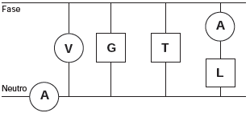

     Um eletricista analisa o diagrama de uma instalação elétrica residencial para planejar medições de tensão e corrente em uma cozinha. Nesse ambiente existem uma geladeira (G), uma tomada (T) e uma lâmpada (L), conforme a figura. O eletricista deseja medir a tensão elétrica aplicada à geladeira, a corrente total e a corrente na lâmpada. Para isso, ele dispõe de um voltímetro (V) e dois amperímetros (A).

Para realizar essas medidas, o esquema da ligação desses instrumentos está representado em:

- [ ] 
- [ ] 
- [ ] 
- [ ] 
- [x] 

Para efetuar tais medições, o eletricista deve associar:

• o voltímetro em paralelo à geladeira,

• um amperímetro em série para com a lâmpada e

• outro amperímetro em série com todo o arranjo.

Assim, tem-se a alternativa E.

