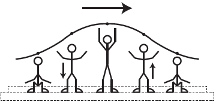

     Uma manifestação comum das torcidas em estádios de futebol é a ola mexicana. Os espectadores de uma linha, sem sair do lugar e sem se deslocarem lateralmente, ficam de pé e se sentam, sincronizados com os da linha adjacente. O efeito coletivo se propaga pelos espectadores do estádio, formando uma onda progressiva, conforme ilustração.

     Calcula-se que a velocidade de propagação dessa “onda humana” é 45 km/h, e que cada período de oscilação contém 16 pessoas, que se levantam e sentam organizadamente e distanciadas entre si por 80 cm.

Disponível em: www.ufsm.br. Acesso em: 7 dez. 2012 (adaptado).

Nessa *ola *mexicana, a frequência da onda, em hertz, é um valor mais próximo de

- [ ] 0,3.
- [ ] 0,5.
- [x] 1,0.
- [ ] 1,9.
- [ ] 3,7.

No intervalo de tempo de um período, a onda sofre um deslocamento de:

$\Delta s = 15 \cdot 0,8$

$\Delta s = 12\\,m$

Utilizando a equação da velocidade e ajustando as unidades de medidas para o sistema internacional, tem-se:

$V = \cfrac{\Delta s}{\Delta t}$

$V = \cfrac{\Delta s}{T}$

$V = \Delta s \cdot f$

$\cfrac{45}{3,6} = 12 \cdot f$

$f = \cfrac{45}{43,2}$

$f \approx 1,04\\,Hz$

**Observação:**\
A solução apresentada é a esperada pela banca examinadora. Porém, é importante salientar que o fenômeno apresentado é um pulso, que não é um fenômeno periódico e, portanto, não se aplica o conceito de período e frequência.
