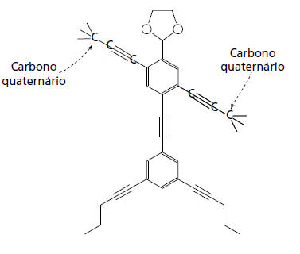

# q
As moléculas de *nanoputians *lembram figuras humanas e foram criadas para estimular o interesse de jovens na compreensão da linguagem expressa em fórmulas estruturais, muito usadas em química orgânica. Um exemplo é o NanoKid, representado na figura:

Em que parte do corpo do NanoKid existe carbono quaternário?

# a
Mãos.

# b
Cabeça.

# c
Tórax.

# d
Abdômen.

# e
Pés.

# r
a

# s
Levando em conta que carbono quaternário é aquele ligado a outros quatro átomos de carbono, tal situação estará presente nas mãos do NanoKid.

