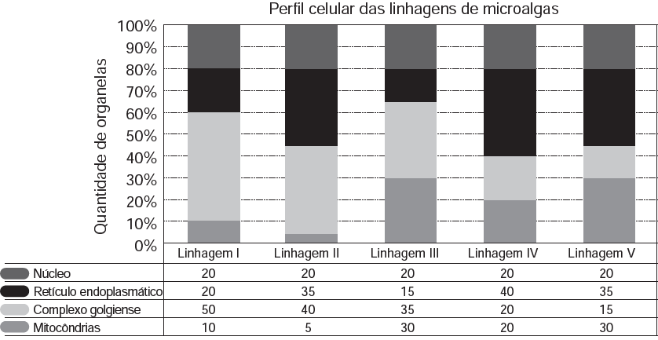

     Uma indústria está escolhendo uma linhagem de microalgas que otimize a secreção de polímeros comestíveis, os quais são obtidos do meio de cultura de crescimento. Na figura podem ser observadas as proporções de algumas organelas presentes no citoplasma de cada linhagem.

Qual é a melhor linhagem para se conseguir maior rendimento de polímeros secretados no meio de cultura?

- [x] I
- [ ] II
- [ ] III
- [ ] IV
- [ ] V

Considerando-se que a principal estrutura celular relacionada à secreção é o complexo golgiense, a alternativa mais plausível, nas condições apresentadas, é aquela que aponta para a linhagem I.

        