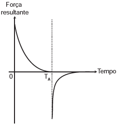
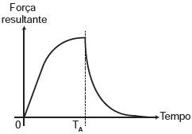
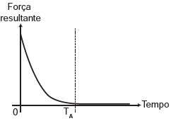
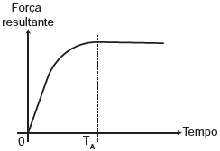

     Em um dia sem vento, ao saltar de um avião, um paraquedista cai verticalmente até atingir a velocidade limite. No instante em que o paraquedas é aberto (instante $T\_{A}$), ocorre a diminuição de sua velocidade de queda. Algum tempo após a abertura do paraquedas, ele passa a ter velocidade de queda constante, que possibilita sua aterrissagem em segurança.

Que gráfico representa a força resultante sobre o paraquedista, durante o seu movimento de queda?

- [ ] 
- [x] 
- [ ] 
- [ ] 
- [ ] 

Entre o instante em que o movimento se inicia e o instante em que o paraquedista atinge a velocidade limite, o movimento é para baixo, retilíneo e acelerado. Portanto,

$\downarrow v$   $\downarrow \gamma$               $\downarrow R$\
 ** MRA**

em que:

“v” é a velocidade do paraquedista,\
“$\gamma$” é a aceleração do paraquedista,\
“R” é a resultante das forças no paraquedista.

A partir do instante em que o paraquedas se abre ($T\_{A}$), a velocidade diminui. Portanto, o movimento é para baixo, retilíneo e retardado:

$\downarrow v$ $\uparrow \gamma$               $\uparrow R$\
 **MRR**

Finalmente, em um instante posterior ao da abertura do paraquedas, a velocidade se torna constante. Portanto, o movimento é retilíneo e uniforme:

$\ce{MRU -> R} = 0$

O gráfico que apresenta resultantes em sentidos opostos nos dois primeiros intervalos de tempo e resultante nula no último intervalo é o da alternativa B.

Observação: apesar de o paraquedista saltar de um avião, admitimos que a sua velocidade inicial é nula para que a queda seja vertical.
