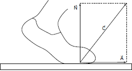

     Uma pessoa necessita da força de atrito em seus pés para se deslocar sobre uma superfície. Logo, uma pessoa que sobe uma rampa em linha reta será auxiliada pela força de atrito exercida pelo chão em seus pés.

Em relação ao movimento dessa pessoa, quais são a direção e o sentido da força de atrito mencionada no texto?

- [ ] Perpendicular ao plano e no mesmo sentido do movimento.
- [ ] Paralelo ao plano e no sentido contrário ao movimento.
- [x] Paralelo ao plano e no mesmo sentido do movimento.
- [ ] Horizontal e no mesmo sentido do movimento.
- [ ] Vertical e sentido para cima.

Quando uma pessoa anda sobre a superfície plana, sofre a ação de uma força aplicada pelo chão (contato $\overrightarrow{C}$ ), cujo componente atrito possui direção paralela ao chão e sentido igual ao do movimento da pessoa.

