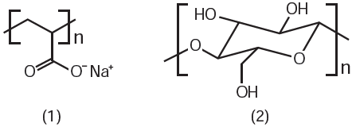
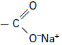

     As fraldas descartáveis que contêm o polímero poliacrilato de sódio **(1)** são mais eficientes na retenção de água que as fraldas de pano convencionais, constituídas de fibras de celulose **(2)**.

CURI, D. **Química Nova na Escola,** São Paulo, n. 23, maio 2006 (adaptado).

A maior eficiência dessas fraldas descartáveis, em relação às de pano, deve-se às

- [ ] interações dipolo-dipolo mais fortes entre o poliacrilato e a água, em relação às ligações de hidrogênio entre a celulose e as moléculas de água.
- [ ] interações íon-íon mais fortes entre o poliacrilato e as moléculas de água, em relação às ligações de hidrogênio entre a celulose e as moléculas de água.
- [ ] ligações de hidrogênio mais fortes entre o poliacrilato e a água, em relação às interações íon-dipolo entre a celulose e as moléculas de água.
- [ ] ligações de hidrogênio mais fortes entre o poliacrilato e as moléculas de água, em relação às interações dipolo induzido-dipolo induzido entre a celulose e as moléculas de água.
- [x] interações íon-dipolo mais fortes entre o poliacrilato e as moléculas de água, em relação às ligações de hidrogênio entre a celulose e as moléculas de água.

O polímero poliacrilato de sódio apresenta o grupo :

, que formará com a água interação do tipo íon-dipolo. Este é mais forte que as ligações de hidrogênio presentes na interação da água com os grupos hidroxilas da celulose.
