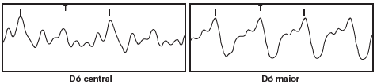
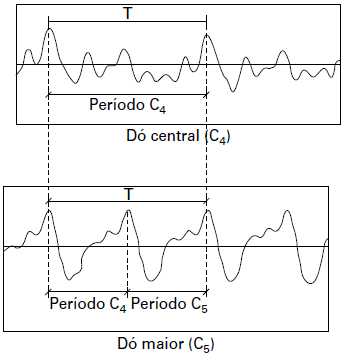

# q
     Em um piano, o Dó central e a próxima nota Dó (Dó maior) apresentam sons parecidos, mas não idênticos. É possível utilizar programas computacionais para expressar o formato dessas ondas sonoras em cada uma das situações como apresentado nas figuras, em que estão indicados intervalos de tempo idênticos (T).

A razão entre as frequências do Dó central e do Dó maior é de:

# a
$\cfrac{1}{2}$

# b
$2$

# c
$1$

# d
$\cfrac{1}{4}$

# e
$4$

# r
a

# s
Inicialmente, pode-se utilizar o gráfico apresentado para representar os períodos correspondentes ao Dó central ($C\_4$) e ao Dó maior ($C\_5$):

De acordo com os gráficos acima, pode-se identificar que:

Período $C\_4 = 2 \cdot Período\cdot C\_5$

Lembrando que a frequência é o inverso do período, tem-se:

$\cfrac{1}{f\_{C\_4}} = 2 \cdot \cfrac{1}{f\_{C\_5}}$

$\cfrac{f\_{C\_4}}{f\_{C\_5}} = \cfrac{1}{2}$
