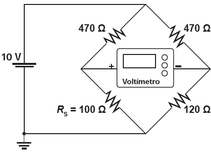
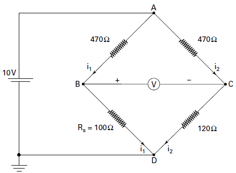

     Medir temperatura é fundamental em muitas aplicações, e apresentar a leitura em mostradores digitais é bastante prático. O seu funcionamento é baseado na correspondência entre valores de temperatura e de diferença de potencial elétrico. Por exemplo, podemos usar o circuito elétrico apresentado, no qual o elemento sensor de temperatura ocupa um dos braços do circuito ($R_s$) e a dependência da resistência com a temperatura é conhecida.

Para um valor de temperatura em que $R_s = 100 \Omega$, a leitura apresentada pelo voltímetro será de

- [ ] \+ 6,2 V.
- [ ] \+ 1,7 V.
- [ ] \+ 0,3 V.
- [x] – 0,3 V.
- [ ] – 6,2 V.

No circuito, considera-se o voltímetro como sendo ideal, não haverá formação de corrente elétrica entre os pontos B e C.

Além disso, da maneira como o voltímetro foi ligado, ele medirá a diferença de potencial $U\_{BC} = V\_{B} - V\_{C}$

**trecho ABD**

$U\_{ABD} = R\_{1} \cdot i\_{1}$

$10 = (470 + 100) \cdot i\_{1}$

$i\_{1} = \cfrac{10}{570}A$

$i\_{1} = \cfrac{1}{57}A$

Assim, pode-se calcular:

$U\_{AB} = 470 \cdot i\_{1} = 470 \cdot \cfrac{1}{57}$

$U\_{AB} = \cfrac{470}{57}V$

A leitura do voltímetro será, portanto:

$U\_{BC} = U\_{AC} - U\_{AB} = \cfrac{470}{59} - \cfrac{470}{57}$

$U\_{BC} \approx 7,97 - 8,25$

$U\_{BC} = -0,28 V =>U\_{BC} \approx -0,3V$

 

**trecho ACD**

$U\_{ACD} = R\_{2} \cdot i\_{2}$

$10 = (470 + 120) \cdot i\_2$

$i\_2 = \cfrac{10}{590}$

$i\_2 = \cfrac{1}{59}A$

$U\_{AC} = 470 \cdot i\_2 = 470 \cdot \cfrac{1}{59}$

$U\_{AC} = \cfrac{470}{59}V$
