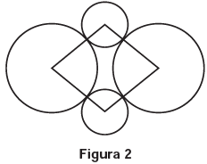

     O losango representado na Figura 1 foi formado pela união dos centros das quatro circunferências tangentes, de raios de mesma medida.

Dobrando-se o raio de duas das circunferências centradas em vértices opostos do losango e ainda mantendo-se a configuração das tangências, obtém-se uma situação conforme ilustrada pela Figura 2.

O perímetro do losango da Figura 2, quando comparado ao perímetro do losango da Figura 1, teve um aumento de

- [ ] 300%.
- [ ] 200%.
- [ ] 150%.
- [ ] 100%.
- [x] 50%.

Sendo:

R: a medida do raio de cada circunferência da figura 1;\
$P\_1$: perímetro do losango da figura 1;\
$P\_2$: perímetro do losango da figura 2.

Temos:

$P\_1 = 4 \cdot 2R$

$P\_1 = 8R$

$P\_2 = 4 \cdot 3R$

$P\_2 = 12R$

Assim, $\cfrac{P\_2}{P\_1} = \cfrac{12R}{8R}$

$P\_2 = 1,5 \cdot P\_1$

Logo, o perímetro do losango da figura 2 teve um aumento de 50%.
