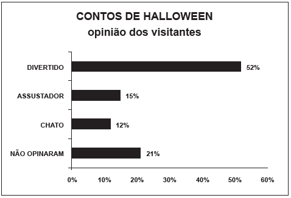

     Em um blog de variedades, músicas, mantras e informações diversas, foram postados “Contos de Halloween”. Após a leitura, os visitantes poderiam opinar, assinalando suas reações em: “Divertido”, “Assustador” ou “Chato”. Ao final de uma semana, o blog registrou que 500 visitantes distintos acessaram esta postagem.

O gráfico a seguir apresenta o resultado da enquete.

O administrador do blog irá sortear um livro entre os visitantes que opinaram na postagem “Contos de Halloween”.

Sabendo que nenhum visitante votou mais de uma vez, a probabilidade de uma pessoa escolhida ao acaso entre as que opinaram ter assinalado que o conto “Contos de Halloween” é “Chato” é mais aproximada por

- [ ] 0,09.
- [ ] 0,12.
- [ ] 0,14.
- [x] 0,15.
- [ ] 0,18.

As pessoas que opinaram representam (52 + 15 + 12)%, ou seja, 79%. Do total, 12% consideraram como “chato” o respectivo conto.

Assim a probabilidade pedida será dada por $\cfrac{12\\%}{79\\%} \approx 0,15$
