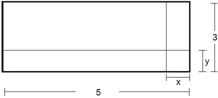

# q
     Um forro retangular de tecido traz em sua etiqueta a informação de que encolherá após a primeira lavagem mantendo, entretanto, seu formato. A figura a seguir mostra as medidas originais do forro e o tamanho do encolhimento (x) no comprimento e (y) na largura. A expressão algébrica que representa a área do forro após ser lavado é (5 – x) (3 – y).

Nestas condições, a área perdida do forro, após a primeira lavagem, será expressa por

# a
2xy

# b
15 − 3x

# c
15 − 5y

# d
−5y − 3x

# e
5y + 3x − xy

# r
e

# s
A área do forro retangular, antes da lavagem, é 5 ⋅ 3 = 15.

A área do forro retangular, após o encolhimento, é (5 – x)(3 – y) = 15 – 5y – 3x + xy.

A área perdida, após a primeira lavagem, é 15 – (15 – 5y – 3x + xy) = 5y + 3x – xy.
