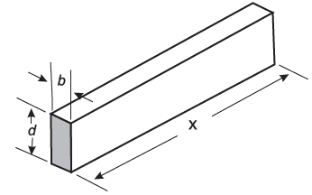

     A resistência mecânica S de uma viga de madeira, em forma de um paralelepípedo retângulo, é diretamente proporcional à sua largura (b) e ao quadrado de sua altura (d) e inversamente proporcional ao quadrado da distância entre os suportes da viga, que coincide com o seu comprimento (x), conforme ilustra a figura. A constante de proporcionalidade k é chamada de resistência da viga.

BUSHAW, D. et al. Aplicações da matemática escolar. São Paulo: Atual, 1997.

A expressão que traduz a resistência S dessa viga de madeira é

- [x] $S = \cfrac{k \cdot b \cdot d^2}{x^2}$
- [ ] $S = \cfrac{k \cdot b \cdot d}{x^2}$
- [ ] $S = \cfrac{k \cdot b \cdot d^2}{x}$
- [ ] $S = \cfrac{k \cdot b^2 \cdot d}{x}$
- [ ] $S = \cfrac{k \cdot b \cdot 2d}{2x}$

S é diretamente proporcional à largura (b) e ao quadrado de sua altura (d), logo é diretamente proporcional ao produto $(b \cdot d^2)$.

Como S é inversamente proporcional ao quadrado do seu comprimento (x), segue que $S = \cfrac{k \cdot b \cdot d^2}{x^2}$
