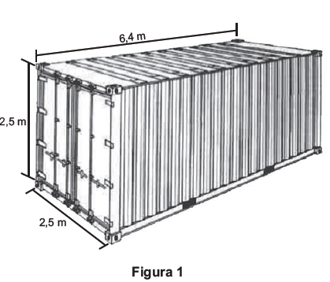
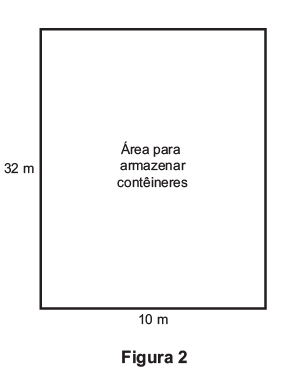
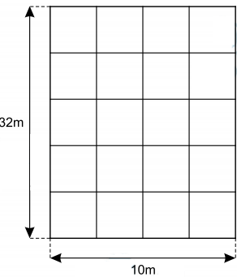

Uma carga de 100 contêineres, idênticos ao modelo apresentado na Figura 1, deverá ser descarregada no porto de uma cidade. Para isso, uma área retangular de 10m por 32 m foi cedida para o empilhamento desses contêineres (Figura 2).

 

De acordo com as normas desse porto, os contêineres deverão ser empilhados de forma a não sobrarem espaços nem ultrapassarem a área delimitada. Após o empilhamento total da carga e atendendo à norma do porto, a altura mínima a ser atingida por essa pilha de contêineres é

- [x] 12,5 m.
- [ ] 17,5 m.
- [ ] 25,0 m.
- [ ] 22,5 m.
- [ ] 32,5 m

1\) Observando que 32 ÷ 6,4 = 5 e 10 $\div$ 2,5 = 4, cada “camada”, na área de armazenamento, comporta 5 x 4 = 20 contêiners.

 

2\) Para armazenar 100 contêineres, serão necessárias (e suficientes) 5 “camadas”, pois 100 $\div$ 20 = 5

 

 

3\) Após o empilhamento total da carga, a altura mínima a ser atingida é 5 . 2,5 m = 12,5 m.
