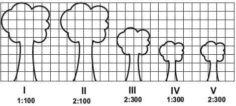

     Um biólogo mediu a altura de cinco árvores distintas e representou-as em uma mesma malha quadriculada, utilizando escalas diferentes, conforme indicações na figura a seguir.

Qual é a árvore que apresenta a maior altura real?

- [ ] I
- [ ] II
- [ ] III
- [x] IV
- [ ] V

Considerando a medida do lado de cada quadrado da malha como unidade de comprimento, vamos calcular a altura real de cada árvore:

$L_I = 9 \cdot 100$    $L_I = 900$

$L\_{II} = 9 \cdot \cfrac{100}{2}$    $L_I = 450$

$L\_{III} = 6 \cdot \cfrac{300}{2}$    $L\_{III} = 900$

$L\_{IV} = 4,5 \cdot 300$    $L\_{IV} = 1350$

$L_V = 4,5 \cdot \cfrac{300}{2}$    $L_V = 675$
