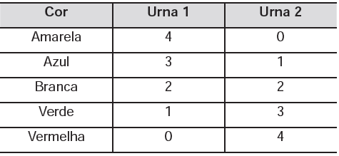

     Em um jogo há duas urnas com 10 bolas de mesmo tamanho em cada urna. A tabela a seguir indica as quantidades de bolas de cada cor em cada urna.

Uma jogada consiste em:

1º) o jogador apresenta um palpite sobre a cor da bola que será retirada por ele da urna 2;

2º) ele retira, aleatoriamente, uma bola da urna 1 e a coloca na urna 2, misturando-a com as que lá estão;

3º) em seguida ele retira, também aleatoriamente, uma bola da urna 2;

4º) se a cor da última bola retirada for a mesma do palpite inicial, ele ganha o jogo.

Qual cor deve ser escolhida pelo jogador para que ele tenha a maior probabilidade de ganhar?

- [ ] Azul.
- [ ] Amarela.
- [ ] Branca.
- [ ] Verde.
- [x] Vermelha.

I. Palpite: Bola Amarela (AM)

$AM\\,\\,\\,AM\\,\\,\\,\overline{AM}\\,\\,\\,AM$\
$\cfrac{4}{10} \cdot \cfrac{1}{11} + \cfrac{6}{10} \cdot \cfrac{0}{10} = \cfrac{4}{110}$

II. Palpite: Bola Azul (AZ)

$AZ\\,\\,\\,AZ\\,\\,\\,\overline{AZ}\\,\\,\\,AZ$\
$\cfrac{3}{10} \cdot \cfrac{2}{11} + \cfrac{7}{10} \cdot \cfrac{1}{11} = \cfrac{13}{110}$

III. Palpite: Bola Branca (BR)

$BR\\,\\,\\,BR\\,\\,\\,\overline{BR}\\,\\,\\,BR$\
$\cfrac{2}{10} \cdot \cfrac{3}{11} + \cfrac{8}{10} \cdot \cfrac{2}{11} = \cfrac{22}{110}$

IV. Palpite: Bola Verde (VD)

$VD\\,\\,\\,VD\\,\\,\\,\overline{VD}\\,\\,\\,VD$\
$\cfrac{1}{10} \cdot \cfrac{4}{11} + \cfrac{9}{10} \cdot \cfrac{3}{11} = \cfrac{31}{110}$

V. Palpite: Bola Vermelha (VM)

$VM\\,\\,\\,VM\\,\\,\\,\overline{VM}\\,\\,\\,VM$\
$\cfrac{0}{10} \cdot \cfrac{4}{11} + \cfrac{10}{10} \cdot \cfrac{4}{11} = \cfrac{40}{110}$

Do exposto, temos que a maior probabilidade de ganhar será na escolha de Bola Vermelha.
