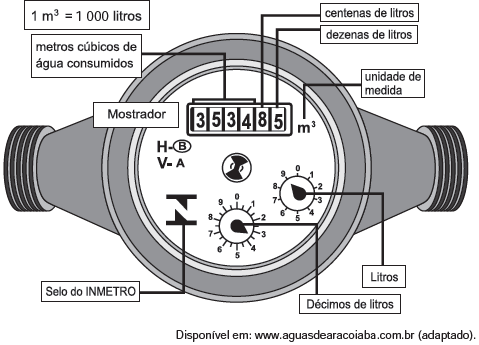

     Os hidrômetros são marcadores de consumo de água em residências e estabelecimentos comerciais. Existem vários modelos de mostradores de hidrômetros, sendo que alguns deles possuem uma combinação de um mostrador e dois relógios de ponteiro. O número formado pelos quatro primeiros algarismos do mostrador fornece o consumo em $m^3$, e os dois últimos algarismos representam, respectivamente, as centenas e dezenas de litros de água consumidos. Um dos relógios de ponteiros indica a quantidade em litros, e o outro em décimos de litros, conforme ilustrados na figura a seguir.

\
Considerando as informações indicadas na figura, o consumo total de água registrado nesse hidrômetro, em litros, é igual a

- [ ] 3 534,85.
- [ ] 3 544,20.
- [ ] 3 534 850,00.
- [x] 3 534 859,35.
- [ ] 3 534 850,39.

Do enunciado, temos:

3534 ⋅ 1000 = 3534000 litros

8 ⋅ 100 = 800 litros

5 ⋅ 10 = 50 litros

9 ⋅ 1 = 9 litros

3,5 ⋅ 0,1 = 0,35 litros

**Total **: 3534859,35 litros
