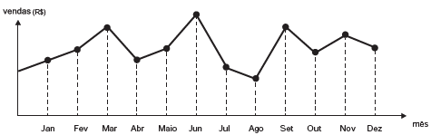

     O dono de uma farmácia resolveu colocar à vista do público o gráfico mostrado a seguir, que apresenta a evolução do total de vendas (em Reais) de certo medicamento ao longo do ano de 2011.

De acordo com o gráfico, os meses em que ocorreram, respectivamente, a maior e a menor venda absolutas em 2011 foram

- [ ] março e abril.
- [ ] março e agosto.
- [ ] agosto e setembro.
- [ ] junho e setembro.
- [x] junho e agosto.

Pela observação do gráfi co, o mês de junho apresenta a maior e agosto a menor venda absolutas.

        