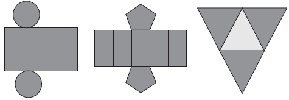

     Maria quer inovar em sua loja de embalagens e decidiu vender caixas com diferentes formatos. Nas imagens apresentadas estão as planificações dessas caixas.

Quais serão os sólidos geométricos que Maria obterá a partir dessas planificações?

- [x] Cilindro, prisma de base pentagonal e pirâmide.
- [ ] Cone, prisma de base pentagonal e pirâmide.
- [ ] Cone, tronco de pirâmide e pirâmide.
- [ ] Cilindro, tronco de pirâmide e prisma.
- [ ] Cilindro, prisma e tronco de cone.

A primeira planificação corresponde a um cilindro; a segunda, a um prisma de base pentagonal; a terceira, a uma pirâmide de base triangular.
