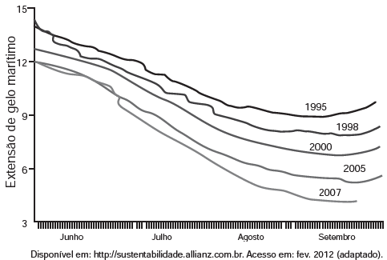

     O gráfico mostra a variação da extensão média de gelo marítimo, em milhões de quilômetros quadrados, comparando dados dos anos 1995, 1998, 2000, 2005 e 2007. Os dados correspondem aos meses de junho a setembro. O Ártico começa a recobrar o gelo quando termina o verão, em meados de setembro. O gelo do mar atua como o sistema de resfriamento da Terra, refletindo quase toda a luz solar de volta ao espaço. Águas de oceanos escuros, por sua vez, absorvem a luz solar e reforçam o aquecimento do Ártico, ocasionando derretimento crescente do gelo.

Com base no gráfico e nas informações do texto, é possível inferir que houve maior aquecimento global em

- [ ] 1995\.
- [ ] 1998\.
- [ ] 2000\.
- [ ] 2005\.
- [x] 2007\.

Do enunciado temos que o gelo resfria a Terra, enquanto águas de oceanos escuros a aquecem.

Assim, o maior aquecimento global ocorrerá no ano com menor extensão de gelo marítimo.

Do gráfico, é o ano 2007.

        