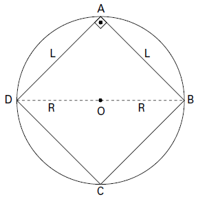

     Em exposições de artes plásticas, é usual que estátuas sejam expostas sobre plataformas giratórias. Uma medida de segurança é que a base da escultura esteja integralmente apoiada sobre a plataforma. Para que se providencie o equipamento adequado, no caso de uma base quadrada que será fixada sobre uma plataforma circular, o auxiliar técnico do evento deve estimar a medida R do raio adequado para a plataforma em termos da medida L do lado da base da estátua.

Qual relação entre R e L o auxiliar técnico deverá apresentar de modo que a exigência de segurança seja cumprida?

- [x] $R \geq \cfrac{L}{\sqrt{2}}$
- [ ] $R \geq \cfrac{2L}{\pi}$
- [ ] $R \geq \cfrac{L}{\sqrt{\pi}}$
- [ ] $R \geq \cfrac{L}{2}$
- [ ] $R \geq \cfrac{L}{(2\sqrt{2})}$

O menor valor de R corresponde à medida do raio de uma circunferência circunscrita a um quadrado de lado L. Dessa forma, temos a figura:

No triângulo ABD, temos:

$(2R)^2 = L^2 + L^2$

$4R^2 = 2L^2$

$R^2 = \cfrac{L^2}{2}$

$R = \cfrac{L}{\sqrt{2}}$

Logo, R deve ser maior ou igual a $R = \cfrac{L}{\sqrt{2}}$, ou seja, $R \geq \cfrac{L}{\sqrt{2}}$
