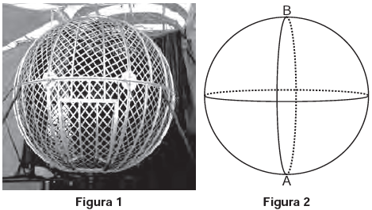
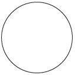
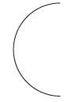
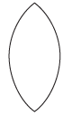

     O globo da morte é uma atração muito usada em circos. Ele consiste em uma espécie de jaula em forma de uma superfície esférica feita de aço, onde motoqueiros andam com suas motos por dentro. A seguir, tem-se, na Figura 1, uma foto de um globo da morte e, na Figura 2, uma esfera que ilustra um globo da morte.

     Na Figura 2, o ponto A está no plano do chão onde está colocado o globo da morte e o segmento AB passa pelo centro da esfera e é perpendicular ao plano do chão. Suponha que há um foco de luz direcionado para o chão colocado no ponto B e que um motoqueiro faça um trajeto dentro da esfera, percorrendo uma circunferência que passa pelos pontos A e B.

Disponível em: www.baixaki.com.br. Acesso em: 29 fev. 2012.

A imagem do trajeto feito pelo motoqueiro no plano do chão é melhor representada por

- [ ] 
- [ ] 
- [ ] 
- [ ] 
- [x] 

Como o plano dessa circunferência, que passa pelos pontos A e B, é perpendicular ao plano do chão, a imagem (ou projeção) do trajeto feito pelo motoqueiro é um segmento de reta.
