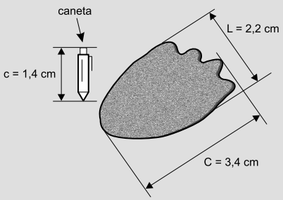

# q
Um pesquisador, ao explorar uma floresta, fotografou uma caneta de 16,8 cm de comprimento ao lado de uma pegada. O comprimento da caneta (c), a largura (L) e o comprimento (C) da pegada, na fotografia, estão indicados no esquema.

 

 

A largura e o comprimento reais da pegada, em centímetros, são, respectivamente, iguais a

# a
4,9 e 7,6.

# b
8,6 e 9,8.

# c
14,2 e 15,4.

# d
26,4 e 40,8.

# e
27,5 e 42,5.

# r
d

# s
1\) Se o comprimento real da caneta é 16,8 cm e o comprimento c dela na fotografia é 1,4 cm, então a razão de semelhança é $\cfrac{16,8}{1,4} = 12$

 

2\) A largura da pegada é (2,2 cm) 12 = 26,4 cm

 

3\) O comprimento da pegada é (3,4 cm) 12 = 40,8 cm
