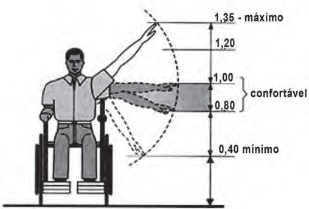

     Num projeto da parte elétrica de um edifício residencial a ser construído, consta que as tomadas deverão ser colocadas a 0,20 m acima do piso, enquanto os interruptores de luz deverão ser colocados a 1,47 m acima do piso. Um cadeirante, potencial comprador de um apartamento desse edifício, ao ver tais medidas, alerta para o fato de que elas não contemplarão suas necessidades. Os referenciais de alturas (em metros) para atividades que não exigem o uso de força são mostrados na figura seguinte.

Uma proposta substitutiva, relativa às alturas de tomadas e interruptores, respectivamente, que atenderá àquele potencial comprador é

- [ ] 0,20 m e 1,45 m.
- [ ] 0,20 m e 1,40 m.
- [ ] 0,25 m e 1,35 m.
- [ ] 0,25 m e 1,30 m.
- [x] 0,45 m e 1,20 m.

A altura relativa às posições das tomadas deve ser maior que a altura mínima alcançada pelo cadeirante (0,40m), e a altura relativa às posições dos interruptores deve ser menor que a altura máxima alcançada por ele (1,35m).

Dentre as alternativas, a que melhor se adapta às condições é a E.
