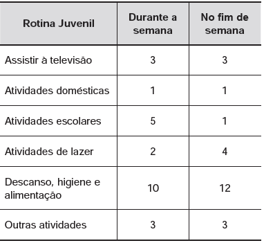

     Uma pesquisa realizada por estudantes da Faculdade de Estatística mostra, em horas por dia, como os jovens entre 12 e 18 anos gastam seu tempo, tanto durante a semana (de segunda-feira a sexta-feira), como no fim de semana (sábado e domingo). A seguinte tabela ilustra os resultados da pesquisa.

De acordo com esta pesquisa, quantas horas de seu tempo gasta um jovem entre 12 e 18 anos, na semana inteira (de segunda-feira a domingo), nas atividades escolares?

- [ ] 20
- [ ] 21
- [ ] 24
- [ ] 25
- [x] 27

$5 \times 5$ = 5 horas em em cada um dos 5 dias durante a semana

$1 \times 2$ = 1 hora em cada um dos 2 dias do fim de semana

total : $5 \times 5 + 1 \times 2 = 27$
