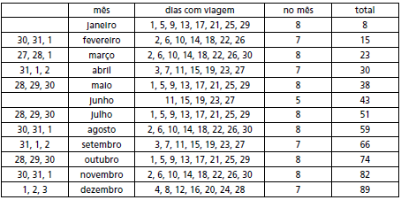

     Um maquinista de trem ganha R$ 100,00 por viagem e só pode viajar a cada 4 dias. Ele ganha somente se fizer a viagem e sabe que estará de férias de 1º a 10 de junho, quando não poderá viajar. Sua primeira viagem ocorreu no dia primeiro de janeiro. Considere que o ano tem 365 dias.

Se o maquinista quiser ganhar o máximo possível, quantas viagens precisará fazer?

- [ ] 37
- [ ] 51
- [ ] 88
- [x] 89
- [ ] 91

•   De 1o de janeiro a 31 de maio, temos 151 dias.

•   De 11 de junho a 31 de dezembro, temos 204 dias.

•   No 1o intervalo, ele viaja nos dias:

(1, 5, 9, …, $a\_{n}$)

$151 \geq 1 + (n-1) \cdot 4$

$154 \geq 4n$

$n \leq 38,5$

O maior valor de n é 38.

•   No 2o intervalo, ele viaja nos dias:

(1, 5, 9, …, $a\_{n}$)

$204 \geq 1 + (n-1) \cdot 4$

$207 \geq 4n$

$n \leq 51,75$

O maior valor de n é 51.

Assim, o número máximo de viagens é 38 + 51 = 89.

**Comentário:**

• Uma viagem a cada 4 dias, com exceção do período de 1 a 10 de junho. As condições dadas no enunciado permitem que se proceda desse modo.

• A viagem no dia 29 de maio é perfeitamente possível, pois, do enunciado, não se pode concluir que cada viagem leva 4 dias (pelo contrário, no cotidiano, com esse tipo de atividade profi ssional, é norma que haja um período adequado de descanso, após cada viagem).

Portanto, nas condições dadas, é perfeitamente possível fazer 89 viagens no ano.
