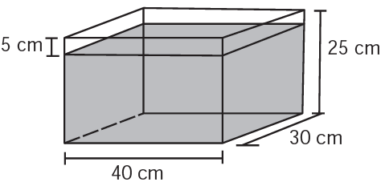

     Alguns objetos, durante a sua fabricação, necessitam passar por um processo de resfriamento. Para que isso ocorra, uma fábrica utiliza um tanque de resfriamento, como mostrado na figura.

O que aconteceria com o nível da água se colocássemos no tanque um objeto cujo volume fosse de 2 400 $cm^3$?

- [ ] O nível subiria 0,2 cm, fazendo a água ficar com 20,2 cm de altura.
- [ ] O nível subiria 1 cm, fazendo a água ficar com 21 cm de altura.
- [x] O nível subiria 2 cm, fazendo a água ficar com 22 cm de altura.
- [ ] O nível subiria 8 cm, fazendo a água transbordar.
- [ ] O nível subiria 20 cm, fazendo a água transbordar.

Sendo h cm o quanto o nível da água sobe, colocando-se o objeto no tanque, temos que:

$30 \cdot 40 \cdot h = 2400$

h = 2

Como a altura da água é 20cm, se colocássemos o objeto no tanque, o nível da água subiria 2cm, fazendo a água ficar com 22cm de altura.
