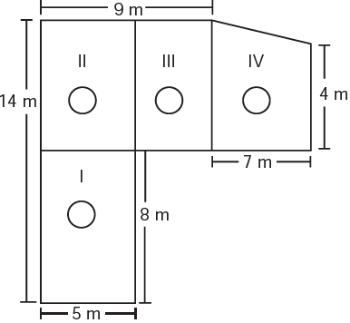
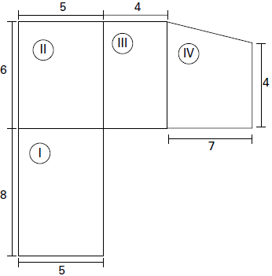

     Jorge quer instalar aquecedores no seu salão de beleza para melhorar o conforto dos seus clientes no inverno. Ele estuda a compra de unidades de dois tipos de aquecedores: modelo A, que consome 600 g/h (gramas por hora) de gás propano e cobre 35 $m^2$ de área, ou modelo B, que consome 750 g/h de gás propano e cobre 45 $m^2$ de área. O fabricante indica que o aquecedor deve ser instalado em um ambiente com área menor do que a da sua cobertura. Jorge vai instalar uma unidade por ambiente e quer gastar o mínimo possível com gás. A área do salão que deve ser climatizada encontra-se na planta seguinte (ambientes representados por três retângulos e um trapézio).

Avaliando-se todas as informações, serão necessários

- [ ] quatro unidades do tipo A e nenhuma unidade do tipo B.
- [ ] três unidades do tipo A e uma unidade do tipo B.
- [x] duas unidades do tipo A e duas unidades do tipo B.
- [ ] uma unidade do tipo A e três unidades do tipo B.
- [ ] nenhuma unidade do tipo A e quatro unidades do tipo B.

A fi gura abaixo mostra os 4 ambientes com suas respectivas medidas:

$A\_{I} = 5 \cdot 8 = 40m^2$ (modelo B)

$A\_{II} = 6 \cdot 5 = 30m^2$ (modelo A)

$A\_{III} = 6 \cdot 4 = 24m^2$ (modelo A)

$A\_{IV} = \cfrac{(6+4) \cdot 7}{2} = 35 m^2$ (modelo B)
