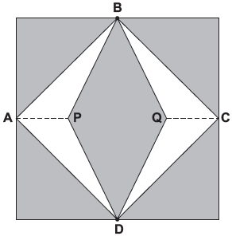
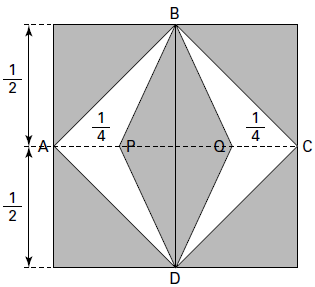

     Para decorar a fachada de um edifício, um arquiteto projetou a colocação de vitrais compostos de quadrados de lado medindo 1 m, conforme a figura a seguir.

Nesta figura, os pontos A, B, C e D são pontos médios dos lados do quadrado e os segmentos AP e QC medem 1/4 da medida do lado do quadrado. Para confeccionar um vitral, são usados dois tipos de materiais: um para a parte sombreada da figura, que custa R$ 30,00 o $m^2$, e outro para a parte mais clara (regiões ABPDA e BCDQB), que custa R$ 50,00 o $m^2$.

De acordo com esses dados, qual é o custo dos materiais usados na fabricação de um vitral?

- [ ] R$ 22,50
- [x] R$ 35,00
- [ ] R$ 40,00
- [ ] R$ 42,50
- [ ] R$ 45,00

Sejam $A_S$ e $A_C$, respectivamente, área sombreada e área clara.

O custo dos materiais usados na fabricação de um vitral é dado por:

$C = 30 \cdot A_S + 50 \cdot A_C$

Observe a figura:

Nela,

$A_C = 4 \cdot A\_{APB}$ , onde $A\_{APB}$ indica a área do triângulo APB.

$A_C = 4 \cdot \frac{\cfrac{1}{4}\ \cdot \cfrac{1}{2}}{2}$

$A_C = \cfrac{1}{4} m^2$

Dessa forma, $A_S$ pode ser calculada do seguinte modo:

$A_S = 1^2 - \cfrac{1}{4}$

$A_S = \cfrac{3}{4}m^2$

Então,

$C = 30 \cdot \cfrac{3}{4} + 50 \cdot \cfrac{1}{4}$

C = 35 reais.

        